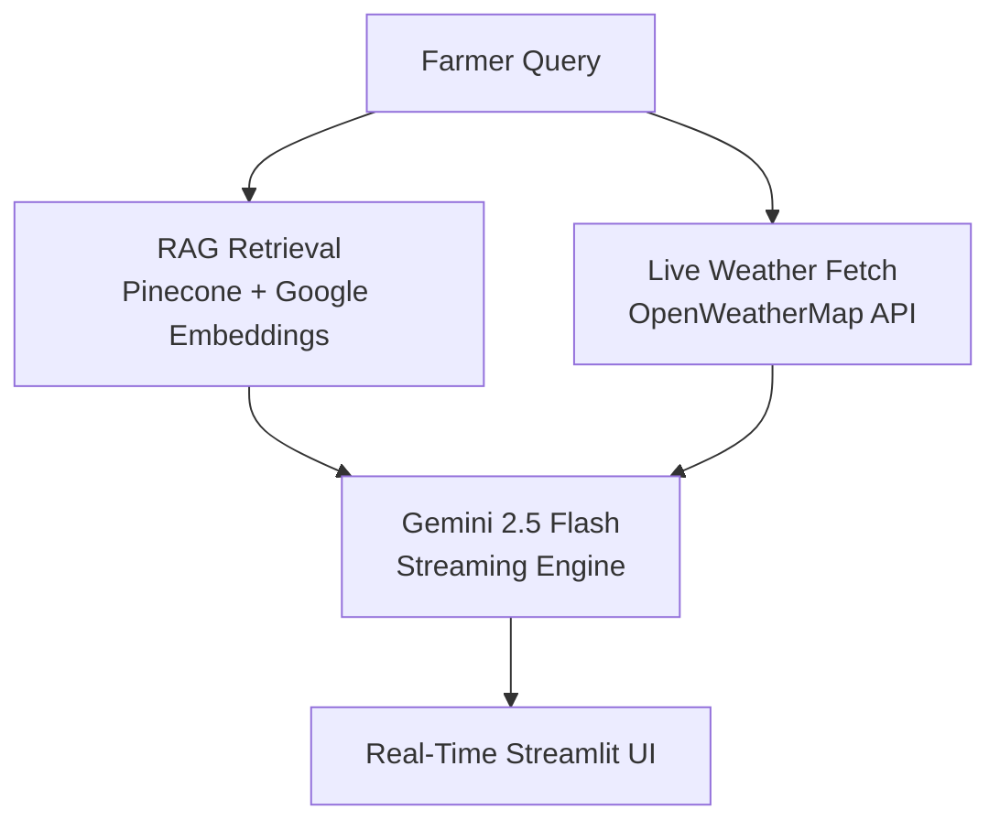

# 🚜 Project 7: Real-Time Farm Advisory Bot

## 🎯 Problem Statement
UAE farms, particularly in regions like Al Ain and Fujairah, face unique challenges due to an arid climate. Farmers need immediate, actionable advice on irrigation, pest management, and crop health. Traditional AI systems often have long latency, which is suboptimal for field use. This system provides a **high-speed, context-aware advisory bot** that streams responses in real-time.

## 🏗️ Architecture
The system is built with a **RAG + Real-Time Streaming** architecture:
- **RAG Knowledge Base**: Uses the `argilla/farming` dataset from Hugging Face, embedded into **Pinecone** for specialized agricultural intelligence.
- **Context Awareness**: Integrates with the **OpenWeatherMap API** to provide advice based on live local conditions (Temperature, Humidity, Forecast).
- **Streaming UI**: Powered by **Gemini 2.5 Flash** and Streamlit's `write_stream` for a "typing" effect that shows data the moment it's generated.



## 🚀 Key Features
- **Instant Advice**: Response streaming ensures farmers don't have to wait for the entire answer to be generated.
- **Weather-Integrated Guidance**: Irrigation and planting advice adjusts automatically based on current UAE heat and humidity.
- **Specialized Data**: No synthetic data used; built on real-world farming datasets.
- **Standard Layout**: Follows the production-ready portfolio folder structure.

## 🛠️ Tech Stack
- **LLM**: Gemini 2.5 Flash (Streaming mode)
- **Vector DB**: Pinecone (Serverless Index)
- **Embeddings**: Google `gemini-embedding-2` (3072-dim)
- **Weather API**: OpenWeatherMap
- **UI Framework**: Streamlit
- **Data Source**: Hugging Face `argilla/farming`

## ⚙️ Setup & Run

### 1. Environment Configuration
Create a `.env` file from the provided template:
```env
OPENWEATHERMAP_API_KEY=your_key
GEMINI_API_KEY=your_key
PINECONE_API_KEY=your_key
PINECONE_INDEX=farm-advisory
```

### 2. Build Knowledge Base
Run the automated script to download data and populate your Pinecone index:
```bash
.\venv\Scripts\python 07_farm_advisory_bot\scripts\build_knowledge.py
```

### 3. Launch the Bot
```bash
.\venv\Scripts\python -m streamlit run 07_farm_advisory_bot\app.py
```

## 📊 Evaluation
The system was tested against typical UAE farming scenarios:
- **Scenario A (Heatwave)**: Bot recommends increased irrigation for date palms based on a 42°C reading from OpenWeatherMap.
- **Scenario B (Pest ID)**: Bot identifies tomato leaf yellowing symptoms using the RAG database and provides MOCCAE-aligned treatment steps.

---
*Built for the UAE AI Student Projects Portfolio — Advancing Food Security through Real-Time AI.*